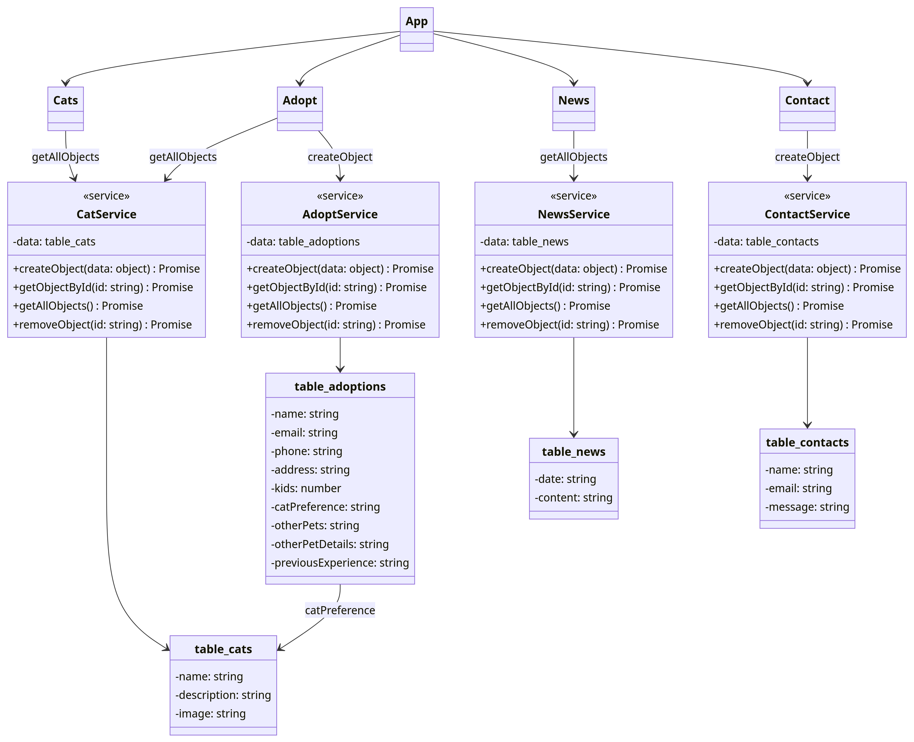
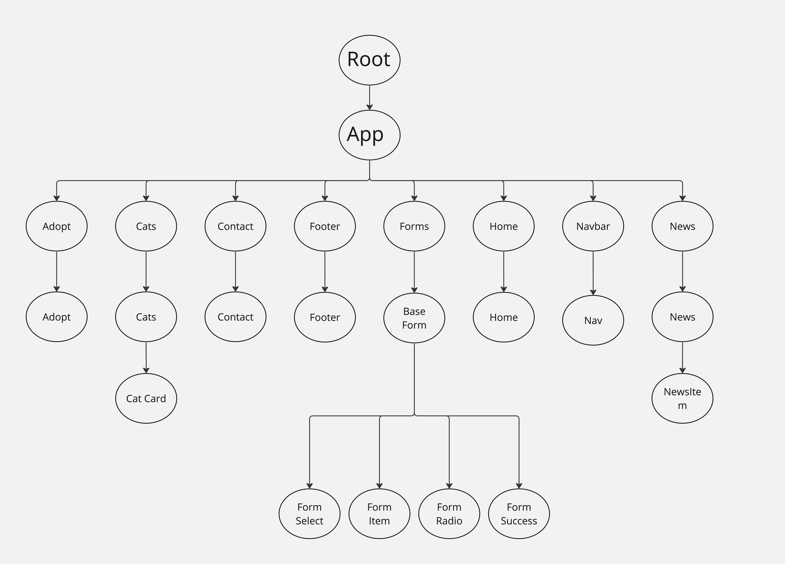

# Cat's Meow Non-Profit Organization Website

Source code for all aspects of website development for the Cats Meow project.

## Introduction

Welcome to the development project for Cat's Meow, a non-profit organization dedicated to finding forever homes for our feline friends. We are in the process of creating a digital platform that will bring potential cat parents and adorable adoptees together.

## Features

The website is designed to serve as an interactive and comprehensive platform for prospective cat parents. The main features include:

1.  Adoptable Cats Catalogue: Users will have the ability to explore a detailed and regularly updated catalogue of cats that are currently looking for a home through the "Our Cats" page. Each cat's profile will feature essential information, including their name, type, and personality.

2.  Adoption Form: We are providing a user-friendly Adoption Form that individuals can fill out directly on the site. The purpose of this form is to gather necessary information about potential adopters, enabling the organization to make the best possible match between human and cat.

The Cat's Meow website aims to create a seamless experience for prospective cat parents, with everything they need in one place to facilitate a successful adoption process.

## New in Feature 4
We configured parse initialization by creating separate parse models for each class.
We also initialized routing from component module to another.

## UML Diagram

## Component Tree Diagram
## UML Diagram

# Partners

Kat Dearstyne & Annalisa Szymanski_
